# ged-view

**A modern, privacy-first GEDCOM viewer. Everything runs in your browser.**

[**ged-view.com**](https://ged-view.com) &nbsp;·&nbsp; No account &nbsp;·&nbsp; No uploads &nbsp;·&nbsp; No data leaves your device

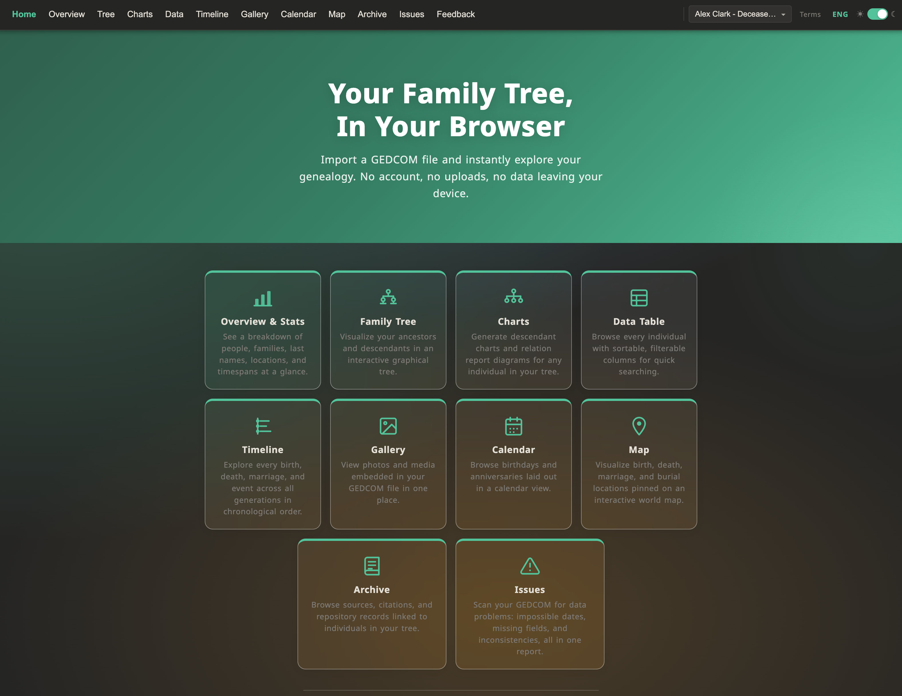

---

## What is this?

Most genealogy platforms are racing toward DNA analysis and AI-assisted research. That's useful, but it leaves a gap: there's no clean, modern way to just *explore* your family data. The richly detailed GEDCOM file you already have on your hard drive deserves better.

I built ged-view as a personal tool to share my own GEDCOM with family in a way they'd actually want to use. Since I'm a developer, a few months later it had grown into a full-featured viewer that works with any GEDCOM file from any platform. The version at [ged-view.com](https://ged-view.com) is a public fork of that private family tool.

Import your `.ged` file and everything happens inside your browser: parsing, layout, geocoding, diagrams. Nothing is uploaded. Nothing is sent anywhere. No account required.

---

## Features

### Overview & Stats
A summary dashboard: total people, families, unique surnames, locations, and the full timespan of your tree at a glance.

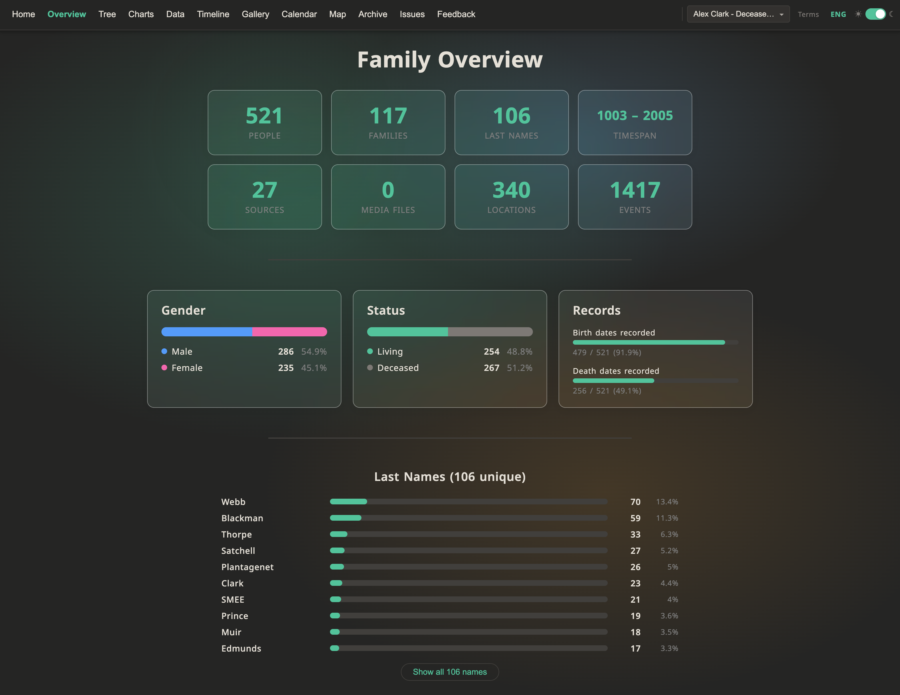

### Family Tree
An interactive graphical tree for navigating ancestors and descendants. Pan, zoom, and click through generations.

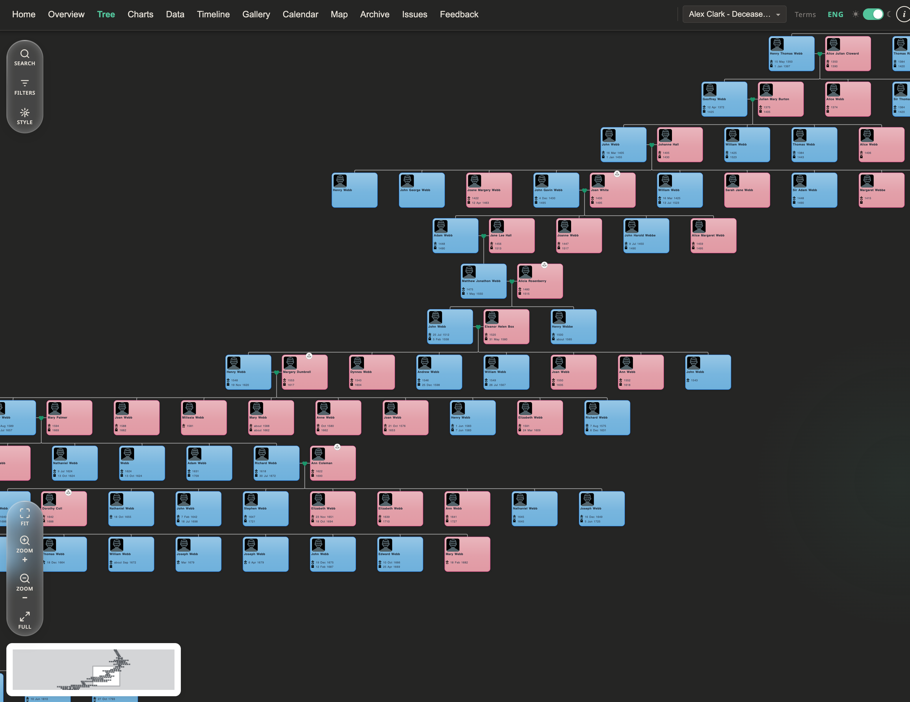

### Charts
Generate a descendant chart for any individual, or produce a relationship diagram between any two people in your tree. More chart types (ancestor, hourglass, fan) are in progress.

### Data Table
Every individual and all their recorded data in a sortable, filterable grid. Search by name, date, location, or any field.

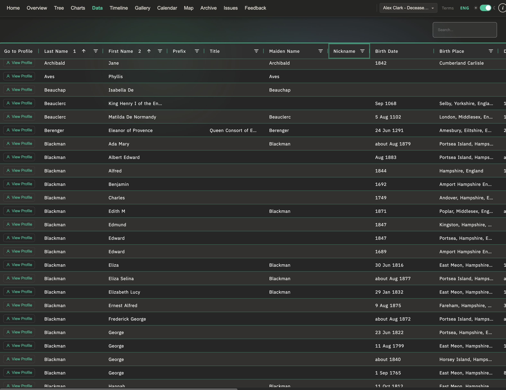

### Timeline
Every birth, death, marriage, and recorded event across all generations laid out in chronological order, with filters to narrow by type or date range.

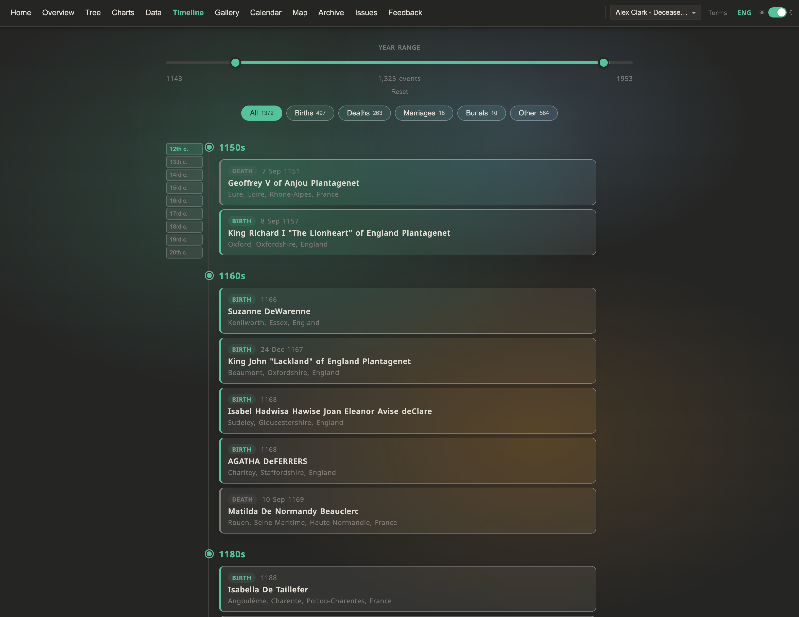

### Gallery
All photos and media embedded in your GEDCOM file collected into one browsable view.

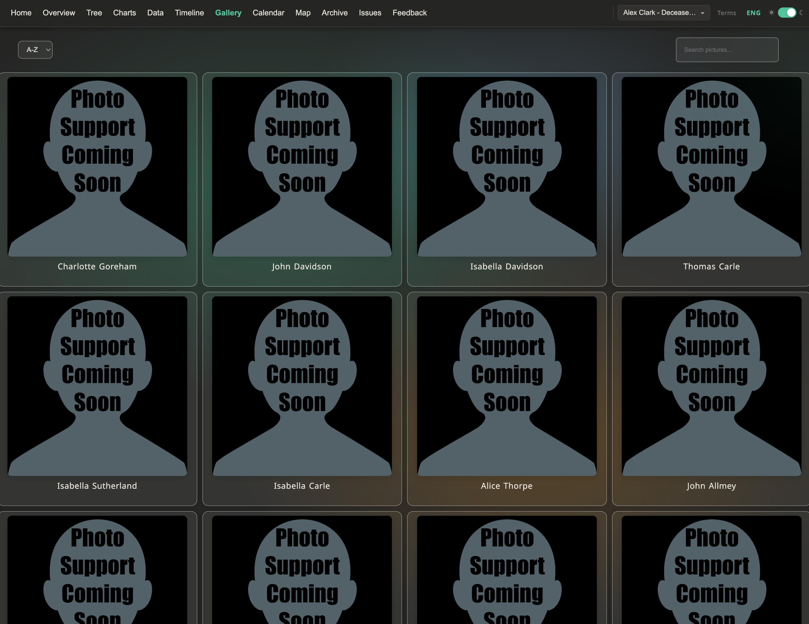

### Calendar
Birthdays and anniversaries displayed in a familiar calendar layout so you never miss one.

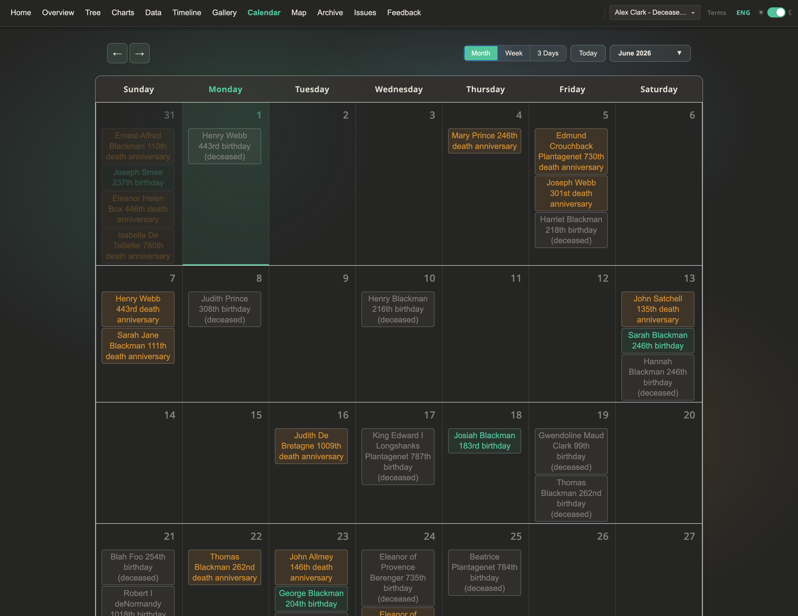

### Map
Birth, death, marriage, and burial locations plotted on an interactive world map, with animated migration paths showing how your family moved across generations.

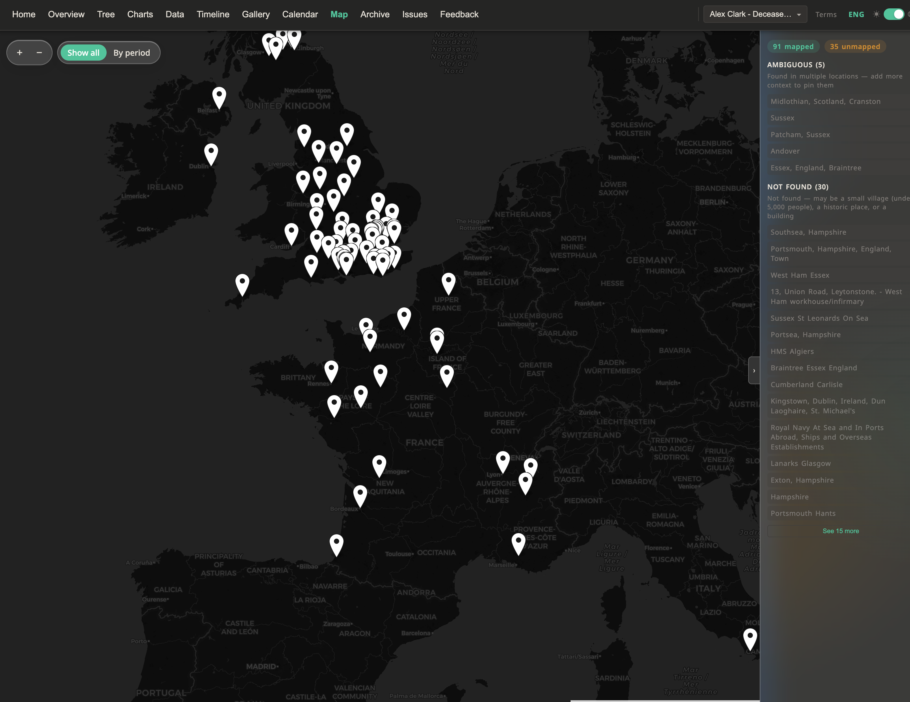
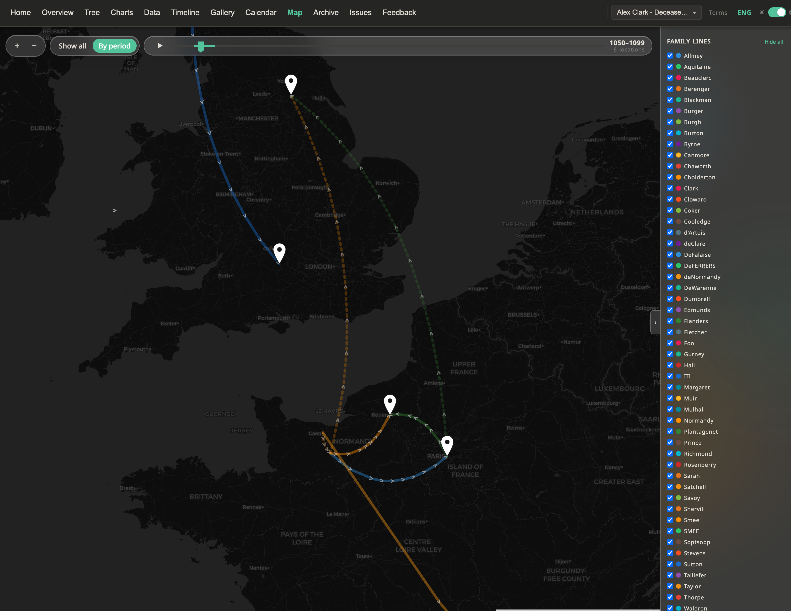

### Archive
Sources, citations, and repository records linked to individuals. All the documentation behind your research in one place.

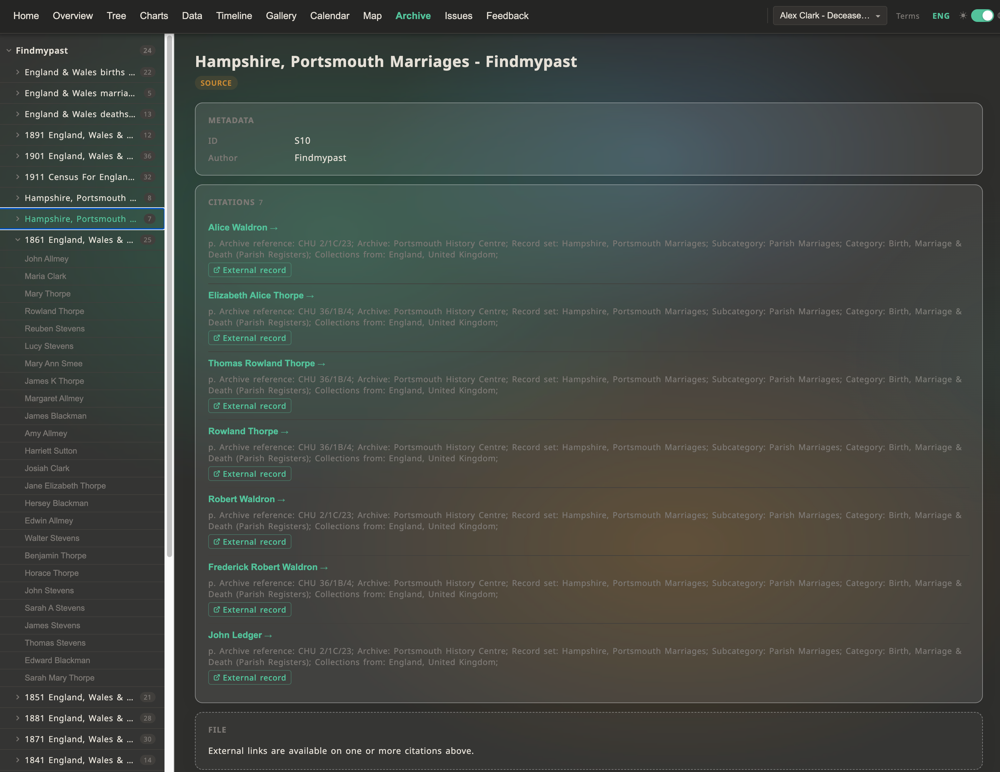

### Issues
Automatic data quality checks: impossible dates, death before birth, missing required fields, and other inconsistencies flagged in one report so you know what to fix.

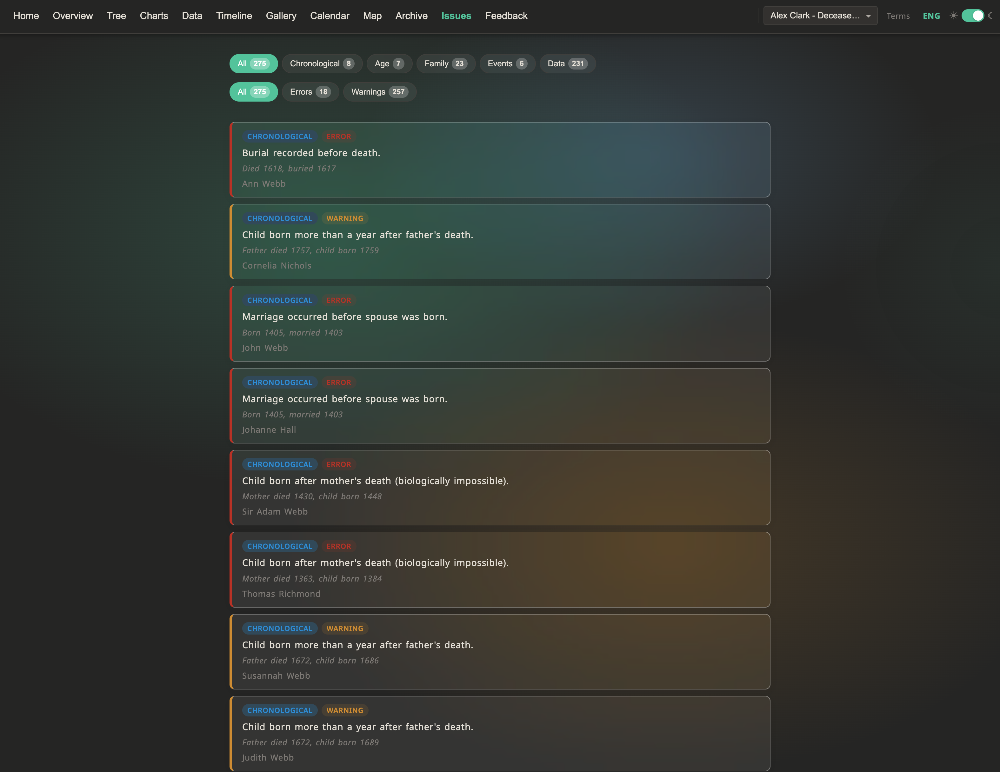

---

## Supported platforms

Export a GEDCOM from any of these and import it at ged-view.com:

- **Ancestry:** Tree Settings → Export Tree → Download GEDCOM
- **MyHeritage:** Manage tree → Export → Export to GEDCOM
- **FamilySearch:** Tools → Export Family Tree → GEDCOM
- **RootsMagic:** File → Export → Export to GEDCOM
- **Gramps:** Family Trees → Export → GEDCOM
- **Family Tree Maker:** File → Export → GEDCOM
- **WikiTree:** Profile → Actions → Export → GEDCOM

Not sure where your file is? Any software that handles family trees can almost certainly export a `.ged` file.

There are also sample files on the site if you want to explore before importing your own.

---

## Privacy

Your data never leaves your device.

When you import a GEDCOM file, it is read and processed entirely inside your browser. The parsing, relationship calculations, geocoding, and diagram rendering all happen locally. Nothing is uploaded to any server. No data is sent to any third party.

Files you import are saved in your browser's local storage so they're available next time you visit. This data stays on your device and can be cleared at any time.

---

## Roadmap

**Completed recently**
- Ancestor & descendant charts
- Animated migration paths on the map
- Relationship finder (e.g. "7th cousin twice removed")
- Localization / interface translations
- Issues / data quality report

**Planned**
- Export everything: tree diagrams, timeline, profiles, and the full data table to PDF, image, CSV, or Excel
- Theme builder for colors, fonts, and card styles
- Larger file support (currently handles up to ~12 MB / 3,000 people in the tree view; 50,000+ across all other views)
- Document & media attachments directly to individuals and events

**Long-term**
- Optional accounts and cloud sync (still fully private, data never sold or shared)
- Family sharing with access controls
- Calendar sync (Google Calendar, Apple Calendar, etc.)
- Collaborative editing with version history

---

## Feedback

I'm looking for input from people who actually use genealogy software:

1. Which views would you use regularly?
2. What's missing that would make this useful in your real research workflow?
3. Does the privacy angle (nothing leaving your browser) matter to you?

Open an issue here or use the feedback form on the site.

---

## License

This is not open source software. The source code, design, and algorithms are proprietary and may not be copied, reproduced, or reused without explicit written permission. Some third-party libraries used are open source under their respective licenses. See [Terms of Use](https://ged-view.com/terms) for full details.

© 2026 Aleksej Cupic. All rights reserved.
